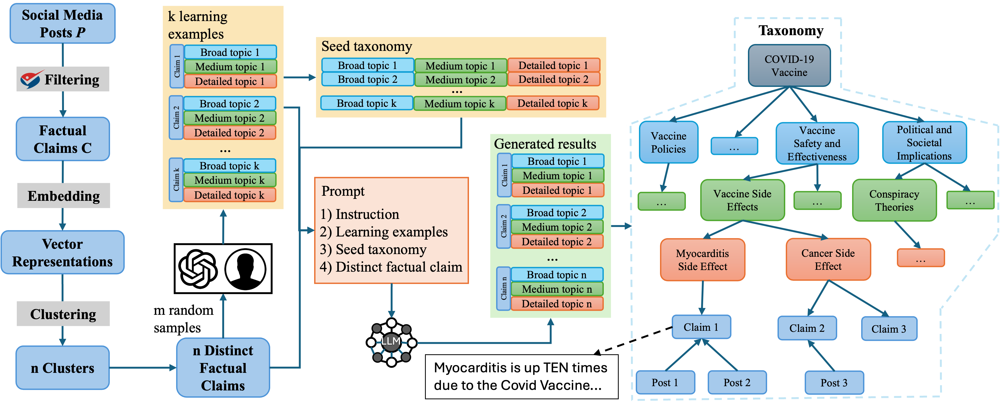

# LLMTaxo

## Note
Due to the privacy issue of social media platforms, we only release tweet id for COVID-19 vaccine dataset. 

The learning examples for LLM prompt are provided in "dataset" folder.

The final taxonmies are provided in "taxonomy" folder.

## Create the Environment
conda env create -f environment.yml

## Perform the Framework
We follow the steps in the framework to build the taxonomy.

### Data Preprocessing
Load data and retrive social media posts that have a ClaiimBuster score > 0.5

`python posts_preprocess.py`

### Clustering
Group identical or nearly identical claims together using HDBSCAN clustering. 

`python clustering.py`

### Identifying Distinct Claim
Select the claim from each cluster as distinct claims for taxonomy construction. 

`python posts_for_topic_generation.py`

### Topic Generation
Use different LLMs for topic generation. 

`python zephyr_infer.py`

`python gpt_infer.py`

`python gemini_infer.py`

### Taxonomy Construction
Consolidate the generated topics to construct a taxonomy.

`python build_taxonomy.py`

### GPT Evaluation
Use GPT-4 to evaluate the quality of claim-topic pairs. 

`python gpt_evaluation.py`

